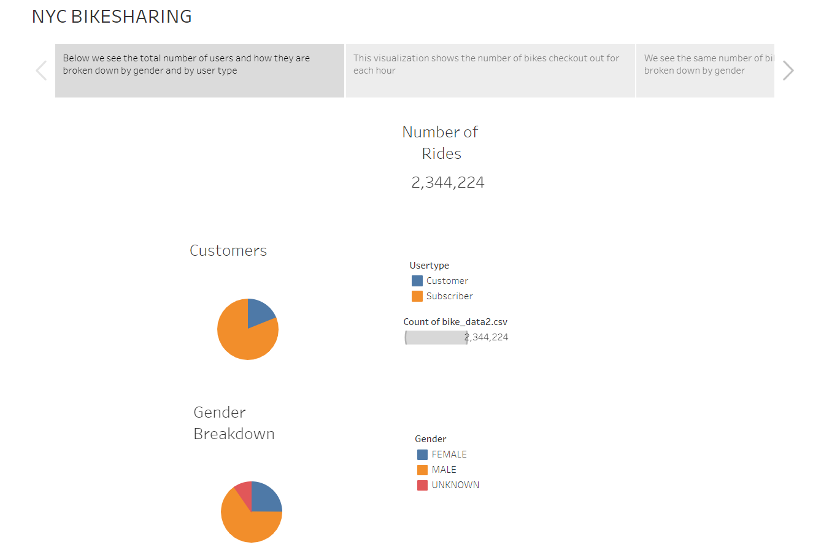
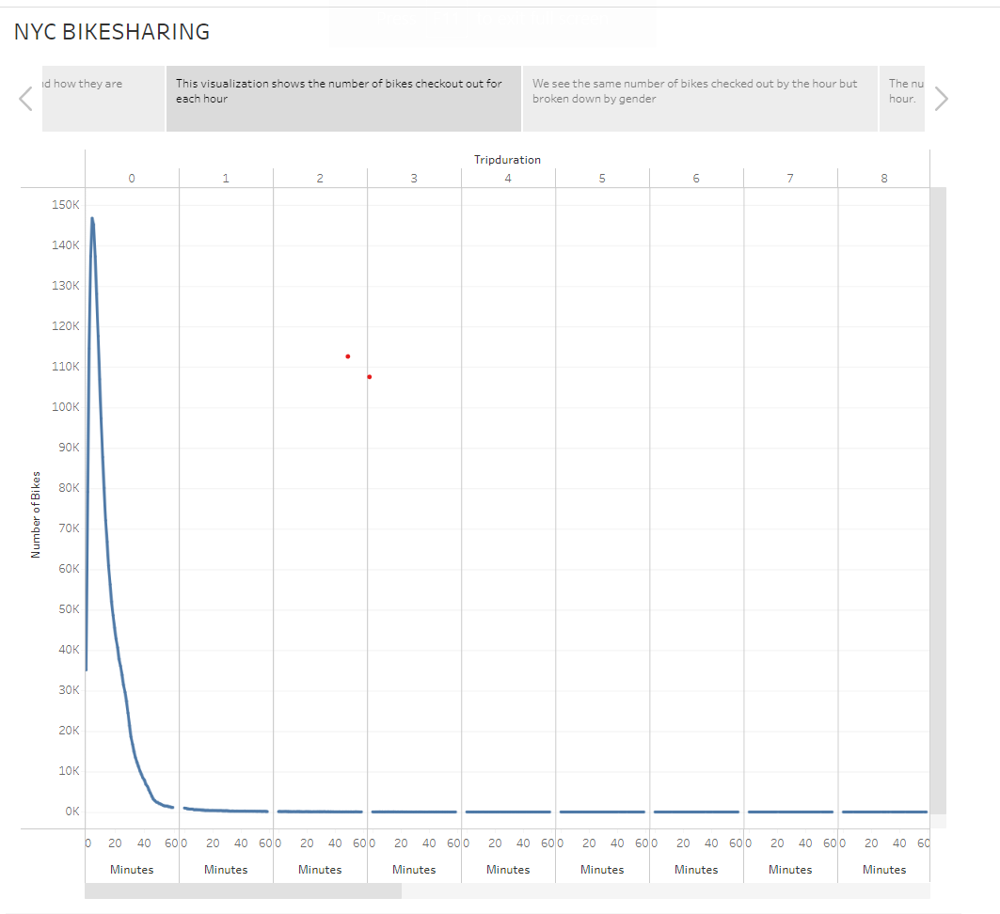
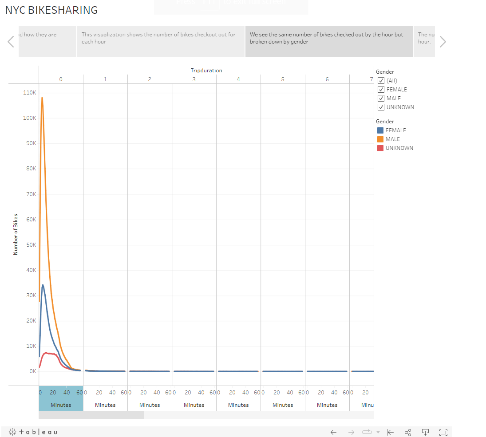
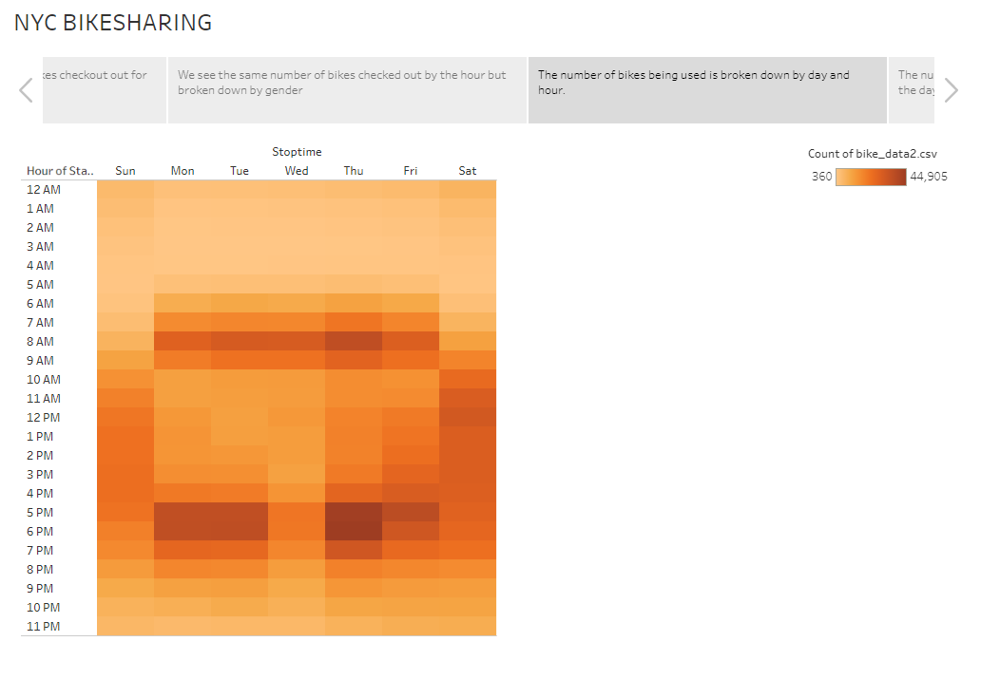
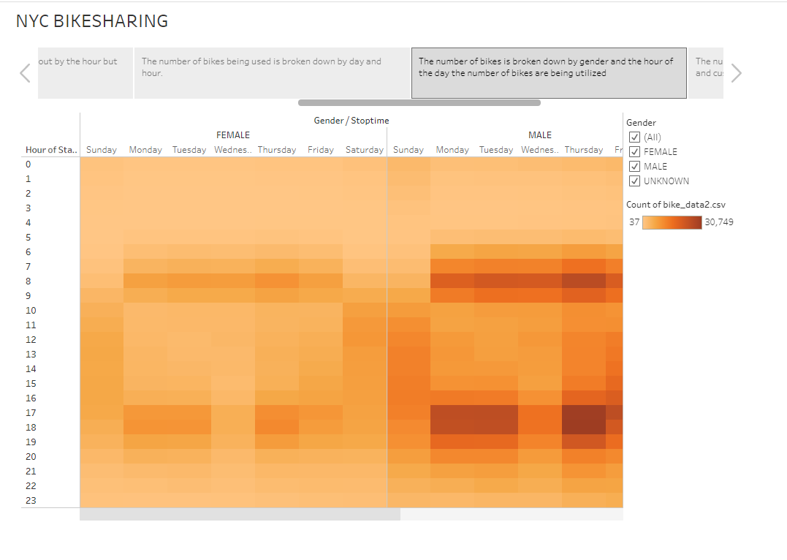
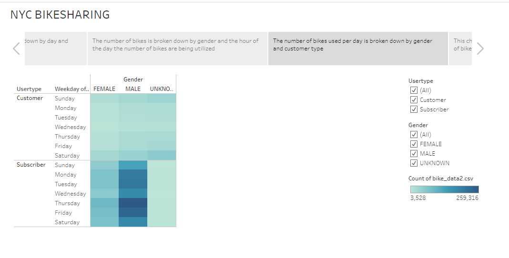
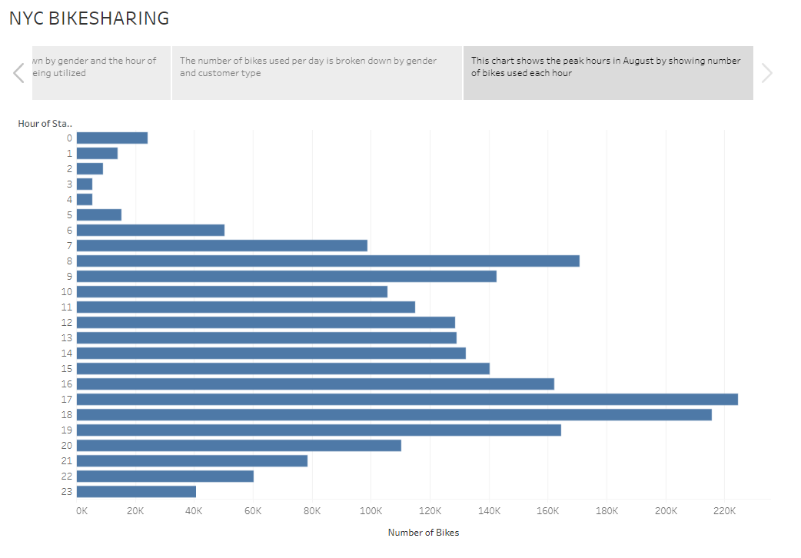

# Bikesharing in NYC
## Overview
Overview of the statistical analysis:
In this analysis, we learn to manipulate our bikesharing data to create visualizations that are easy to understand at a basic level. We create worksheets, stories, and dashboards to share our research.
## Purpose
In researching the idea to create a new bikehsare company in Des Moines, we use Tableau to create visualizations in our presentation to show how the data can be used to understand bike usage across cities.
### Results
The story for our analysis can be found:  
[link to dashboard](https://public.tableau.com/app/profile/priscilla.van.dyke/viz/14challenge/NYCBIKESHARING#2)
 
**Below we see the total number of users and how they are broken down by gender and by user type. There are a total of 2,334,224 number of rides in our data set. We see a majority of riders gender is male. Also our data shows that a majority of riders were subscribers as well.**

This visualization shows the duration of each trip. We see most rides last for under and hour with most rides peaking at about 20 minutes.

We see the same number of bikes checked out by the hour but broken down by gender. A majority of users are men checking out almost 110,000 of bikes. The duration of trips by men are also longer.

The number of bikes being used is broken down by day and hour. We see as the color scale gets darker the saturation of bike being used is higher. There is a higher concentration on the weekends between the hours of 9AM an 6PM. On the weedays there is a higher between 7AM and 9AM, before work, and 5PM and 8PM.

The number of bikes is broken down by gender and the hour of the day the number of bikes are being utilized. We see as the color scale gets darker the saturation of bike being used is higher, much like in the previous visualization. We can see there is more saturation for males.

The number of bikes used per day is broken down by gender and customer type. There are more riders that are subscribers than one time customers. Of subscribers there are more male subscribers.

This chart shows the peak hours in August by showing number of bikes used each hour. The peak hours are between 4PM and 7PM.

Summary:
Through our analysis we see consistant results showing there is a significant demographic towards men. We breakdown, utilization and days of use and see majority of users are male. This can drive our research as we continue to pursue the idea of a bikesharing app in Des Moines. I suggest further analysis to understand how we can promote our app towards our demographic. I would suggest the following visualizations to understand how to better promote design our app.
- I would like to understand more about the locations of where bike apps are most popular. I would like see an analysis of a bargraph showing the bike stations and how often each one is accessed. I would like to see a visualization of this broken down by gender and by user type. This would help me to understand which stations recieve the most traction and how this could work in Des Moines.
- I would also like to do more analysis on birth year and find our market age demographic. I suggest creating an area chart that shows bike utilization by birth year so we can track which age group has the most users. We could also break this down by gender to see if there are specific age groups of each gender that are more likely to use our app.
